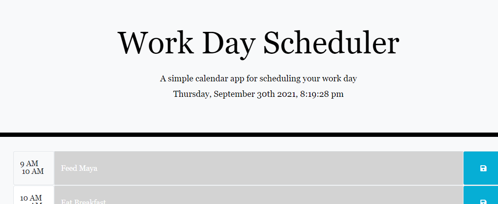

# Work Day Organizer

This project uses jQuery methods and bootstrap (3rd party APIs) to build an interactive scheduler for the user's typical work day (9am to 5pm). At the top of the page, today's date is displayed down to the second. Time blocks are color-coded depending on the current time of day (past in grey, present in red, future in green), and the user has the option to enter in events and save them which persist based on local storage.

## Possible Improvements

* Make it possible to add two events for a single timeblock

## Deployed Link

* [See Live Site](https://emdorgan.github.io/day-planner/)

## Screenshots

## Built With

* [HTML](https://developer.mozilla.org/en-US/docs/Web/HTML)
* [CSS](https://developer.mozilla.org/en-US/docs/Web/CSS)
* [Javascript](https://developer.mozilla.org/en-US/docs/Web/JavaScript)
* [Bootstrap](https://getbootstrap.com/)

## Authors

* **Emily Dorgan** 

- [Link to Portfolio Site](https://emdorgan.github.io/portfolio/)
- [Link to Github](https://github.com/emdorgan)
- [Link to LinkedIn](https://www.linkedin.com/in/emily-dorgan/)

## Acknowledgements

* **Derek Banister**
- Earlier today we got a clock to update every second in a joint project, I reused that code in this assignment